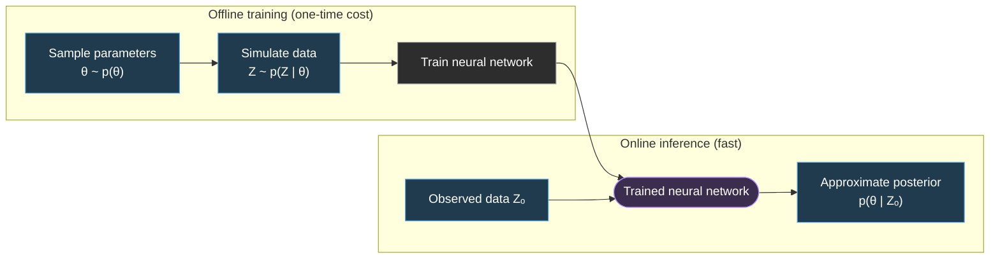

# NeuralEstimators  

[![][CRAN-img]][CRAN-url]
[![][vignette-img]][vignette-url]
[](https://github.com/msainsburydale/NeuralEstimators/actions/workflows/R-CMD-check.yaml)
[](https://app.codecov.io/gh/msainsburydale/NeuralEstimators)

[CRAN-img]: https://img.shields.io/badge/CRAN-blue.svg
[CRAN-url]: https://CRAN.R-project.org/package=NeuralEstimators

[vignette-img]: https://img.shields.io/badge/vignette-blue.svg
[vignette-url]: https://cran.r-project.org/package=NeuralEstimators/vignettes/NeuralEstimators.html

[julia-repo-img]: https://img.shields.io/badge/Julia_repo-purple.svg
[julia-repo-url]: https://github.com/msainsburydale/NeuralEstimators.jl

[julia-docs-img]: https://img.shields.io/badge/Julia_docs-purple.svg
[julia-docs-url]: https://msainsburydale.github.io/NeuralEstimators.jl/dev/

This repository contains the `R` interface to the `Julia` package `NeuralEstimators`. The package facilitates a suite of neural methods for parameter inference in scenarios where simulation from the model is feasible. These methods are **likelihood-free** and **amortised**, in the sense that, once the neural networks are trained on simulated data, they enable rapid inference across arbitrarily many observed data sets in a fraction of the time required by conventional approaches. The package caters for any model for which simulation is feasible by allowing the user to implicitly define their model via simulated data. 

See the [Julia documentation](https://msainsburydale.github.io/NeuralEstimators.jl/dev/) or the [vignette](https://cran.r-project.org/package=NeuralEstimators/vignettes/NeuralEstimators.html) to get started!

### Overview



### Installation

To install the package, please:

1. **Install required software**  
   Ensure you have both [Julia](https://julialang.org/downloads/) and [R](https://www.r-project.org/) installed on your system.

2. **Install the Julia version of `NeuralEstimators`**  
   - To install the current stable version, run the following command in your terminal:  
     ```bash
     julia -e 'using Pkg; Pkg.add("NeuralEstimators")'
     ```  
   - To install the development version, run:  
     ```bash
     julia -e 'using Pkg; Pkg.add(url="https://github.com/msainsburydale/NeuralEstimators.jl")'
     ```

3. **Install the R interface to `NeuralEstimators`**  
   - To install from [CRAN](https://CRAN.R-project.org/package=NeuralEstimators), run the following command in R:  
     ```R
     install.packages("NeuralEstimators")
     ```  
   - To install the development version, first ensure you have `devtools` installed, then run:  
     ```R
     devtools::install_github("msainsburydale/NeuralEstimators")
     ```

### Supporting and citing

This software was developed as part of academic research. If you would like to support it, please star the repository. If you use the software in your research or other activities, please use the citation information accessible with the command:

```R
citation("NeuralEstimators")
```

### Contributing

If you encounter a bug or have a suggestion, please consider [opening an issue](https://github.com/msainsburydale/NeuralEstimators/issues) or submitting a pull request. Instructions for developing vignettes can be found in [vignettes/README.md](https://github.com/msainsburydale/NeuralEstimators/blob/main/vignettes/README.md).